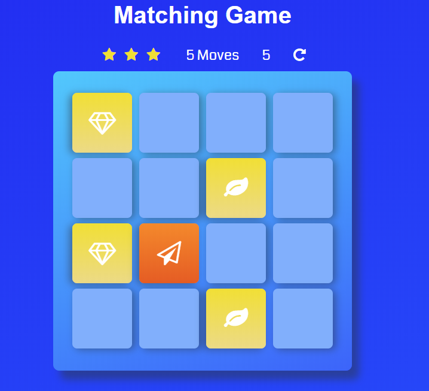

# Udacity's Memory Game Project

This is the second project of Udacity's Front End Developer course.

By: Carlos Fins

The game is playable here:
* [Live Project](https://clockwerkz.github.io/jsMemoryGame/)

## How to Install the Game Locally

Simply click on the green "Clone or Download" button above to download a local copy of the game in order to play. Once downloaded or installe,d simply open the index.html file in a web browser to play.
Alternatively, the game can be played on the live version: [jsMemoryGame](https://clockwerkz.github.io/jsMemoryGame/).

## How To Play

This is the classic Memory Game. A player starts with all cards faced down. Each turn, the player selects two cards. If they match, they remain face up. If they don't, they are turned back over. After all cards are matched, the game is over. The star Scoring is evaluated based on the number of "moves" used in the game. The lesser amount of moves, the better the star rating. Good luck!

## Game Design

Early on, I noticed that if I used Google Chrome tools, I could "see" all of the card icons by inspecting them. In order to get around this, my cards do not have their font awesome icons labeled in the cards at the start. Instead, I've assigned data-values of numbers from 0-15, and I use those data-values to index the array of card icons. So every time a player clicks on a card and reveals it, I'm applying the icon class to the i tag using the array value at that card's data-value index. If they match, play continues and the cards remain revealed. However, if they do not match, my code "removes" the icon from the i tag when flipping them back over.

## Dependencies

* Font-Awesome 4.6.1 for the Game Icons
* Google Fonts for the Coda Font Family

## Licensing

This project is licensed under the Creative Commons Licensing. You are free to:

* Share - copy and redistribute the matertial in any medium or format

* Adapt - remix, transform, and build upon the material for any purpose, even commercially. 
